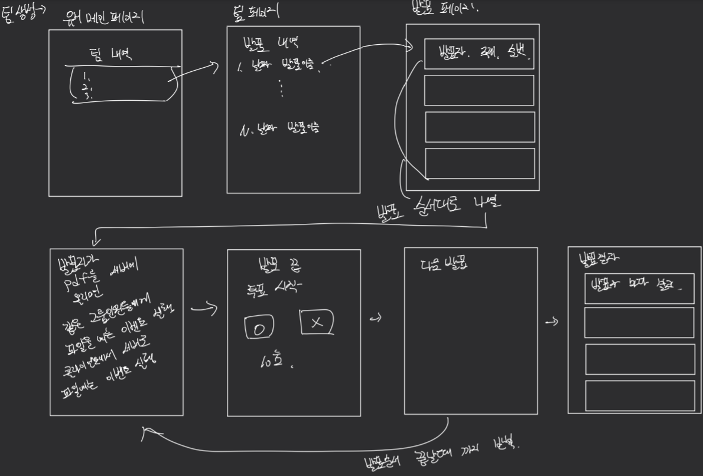

# HPKC 서비스에서 제공할 프론트 단

> 일정에 맞추어 프론트를 시작하려하였지만. 학습과 동시에 작업을 진행하여야하기 때문에 시간이 많이 소요될것같아 진행을 하였음

# 프론트 설계

## 요구사항

1. 기본 적인 레이아웃 구성
2. 각 컴포넌트 만들기
    - 버튼
    - 팀 페이지
    - 유저 페이지
3. 입력창에 정규식을 사용하여 제대로 된 값이 입력되었는지 확인.
4. 홈페이지 꾸미기.
# 레이아웃

## 초기 레이아웃



# 팀

팀에 마우스를 오버하거나 마우스 클릭이 일어나면 수정,삭제 버튼이 나오면서 기능을 선택할 수 있게 끔하기.

# 발표
## 발표 생성
발표를 생성할때 정보를 기입할수 있는 모달을 띄워주자.
모달에는 발표명, 발표 주제, 발표자들, 발표자들 순서를 지정할 수있게하자.

## 발표 삭제

# 예외처리


# 이슈

## 발표 리스트 출력 이슈
발표 리스트를 출력하기 위해서 라우터를 연결하였지만 라우터를 통해 들어갈때 마다 렌더링을 다시 해줘야하지만
useEffect에 빈 배열을 줘서 한번만 렌더링을 하였다. 

빈 배열을 주지 않는다면 계속해서 호출이 일어나는데 어떻게 해결을 할지 고민주

### 해결
useEffect는 deps에 특정 값을 넣게 된다면, 컴포넌트가 처음 아누트 될때에도 호출이되고 지정한 값이 바뀔때에도 호출이 된다.

## 클라이언트 세션관리 이슈
클라이언트에서 유저가 사용중 유저의 세션이 서버단에서 만료가 되면 클라이언트에게 요청을 할 수가 없다.

클라이언트에서 서버에 요청을 보낼때 에러가 생기면 redux를 통해서 로그인 정보를 없애버린다?
- 그러면 클라이언트에서 요청후 오류에 대한 코드 중복이 발생함.
- 서버단에서 토큰에 관한 기능을 좀 더 추가해야함.
### 해결
원래는 리듀서로 로그인 상태 정보를 관리하고있었는데 그럴필요없없음 그냥 로그인 만 하니 서버에서 관리가 전부됨.


## 라우터 이슈
팀("/team")을 선택하고 팀에 있는 발표들의 리스트("/team/list")들을 출력한다. 그리고 그 발표 들 중 하나를 선택하면
발표에 대한 정보를 출력해야하는데 빈 페이지만 나오는 이슈

### 해결
라우터에 라우터를 보여줄때 중첩 라우터는 경로가 같아야지만 지금 보이고 있는 엘리먼트들을 보여주는데
발표의 자세한 정보를 보기위해 path의 경로를 변경 하였더니 경로를 이동하면서 현재 페이지가 다시 그려진것이었음.
>경로 수정 전: /team --> /team/list --> /ptlist/detail

>경로 수정 후: /team --> /team/list --> /tea/list/:teamName

이 경로를 변경하면 제대로 나오는것을 확인.

## 상태 업데이트 이슈
팀을 생성,삭제와 발표 삭제,수정,추천 등 useState에 관련된 상태가 즉각적으로 업데이트가 되기도 하고 안되기도한 이슈가 있었음.
setState 상태에 관한 처리를 해야할것같음.

### 해결
기존에 다른 컴포넌트에서 데이터를 읽고 쓰는 상태값들은 redux로 전역적으로 관리로 다 돌렸음.
## 레이아웃 이슈
라우터기능을 이용하여 페이지를 아예 다른 화면으로 그리고 싶었는데 라우터를 이용하면 밑에 지정한 부분에 렌더링이 된다
### 해결 
모달 기능을 이용하여 화면위에 띄우기로함.

## 발표 상세 정보 저장 후 이슈
발표에서 멤버마다 상세한 정보를 게시 또는 수정하고 저장을하고 나서의 정보가 렌더링 되지 않고 저장 하기 전의 정보가 계속해서
남아있다. 저장 후 저장 된 데이터가 표시되게끔 해야함.
### 해결
```javascript
// PresenterDetail.js
const updateAttendent = (_attendent) => {
    setAttendent(
        attendent.map((ele) => {
            if (ele.name === _attendent.name) return _attendent;
            else return ele;
        })
    );
};
//PresentationList.js
const updatePresenter = (update) => {
        const attendenta = presenter.attendents.map((ele) => {
            if (ele.name === update.name) return update;
            else return ele;
        });
        setpresenter({ ...presenter, attendents: attendenta });
    };
```
위 함수들을 자식 컴포넌트에 전달하여 최종적으로 Presenter.js 에게 주고 
모달에서 저장 이벤트가 일어날때 각 컴포넌트들이 들고있는 객체들을
업데이트 시켜준다. 그리고 모달을 닫을때 서버에 저장된 값을 가져오게해 다시 렌더링을 한다.

## 발표 추천 이슈
1. 발표를 추천했을때 추천한 내용이 서버에는 제대로 저장되지만 프론트단에서는 정보가 제대로 업데이트가 되지않았음.
추천을 눌렀을때 추천된 수와 그림이 바뀌지만 다른 발표자에 갔다오면 추천 전 데이터 그래도 보였음
2. 자신의 발표자료에 추천을 하게된다면 추천 이미지가 바뀌지 않고 기존의 추천 이미지를 보여줌.
### 해결
1. 기존에는 redux에 presenter에서 멤버를 뽑아 attendents로 선택된 발표 인원 리스트를 관리하였지만 불필요한 로직을 수정하며
presenter에 있는 인원을 가져오고 추천을 하였을때 presenter의 데이터를 조금 수정하는것으로 하였음.
이로써 제대로 정보가 업데이트 됨을 확인.